# Certified Sparse Attention

[](https://www.python.org/downloads/)
[](https://pytorch.org/)
[](https://huggingface.co/docs/transformers)
[](tests/)
[](results/REPORT.md)
[](results/REPORT.md)
[](results/REPORT.md)

**Runtime-verified fidelity guarantees for long-context LLM serving.**

`#sparse-attention` `#llm-serving` `#kv-cache` `#long-context` `#pytorch` `#confidence-sequences` `#systems-ml` `#huggingface`

Sparse attention ships an accuracy claim it never checks at runtime. Fidelity loss under KV compression behaves like a **phase transition**, not a smooth slope — so offline operating points fail silently on a subset of live requests. This repository implements the full measurement and verification stack:

```text
"≤ 2% of decode steps diverged from dense execution, at 95% confidence, at ~6% throughput cost."
```

| Artifact | Description | Link |
|---|---|---|
| **REPORT** | Pre-committed H1–H4 verdicts with numbers | [`results/REPORT.md`](results/REPORT.md) |
| **TABLES** | Auto-generated markdown tables (never hand-copied) | [`results/TABLES.md`](results/TABLES.md) |
| **METHODOLOGY** | Threats to validity, written before interpreting results | [`results/METHODOLOGY.md`](results/METHODOLOGY.md) |
| **RFC** | Serving-system integration design (vLLM path) | [`docs/RFC-runtime-fidelity-verification.md`](docs/RFC-runtime-fidelity-verification.md) |

---

## Table of contents

1. [System architecture](#system-architecture)
2. [Headline results (smoke scale)](#headline-results-smoke-scale)
3. [Result catalog with tags](#result-catalog-with-tags)
4. [Figures](#figures)
5. [Repository layout](#repository-layout)
6. [Quick start](#quick-start)
7. [Reproduce studies](#reproduce-studies)
8. [Status and roadmap](#status-and-roadmap)
9. [Citation](#citation)

---

## System architecture

Three cooperating mechanisms turn an unverified sparse claim into a **runtime certificate**:

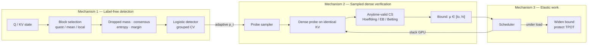

**Paired measurement harness** (Study A substrate): dense and sparse attention share the same Q/KV; selection retains the full cache so the dense counterfactual is exact.

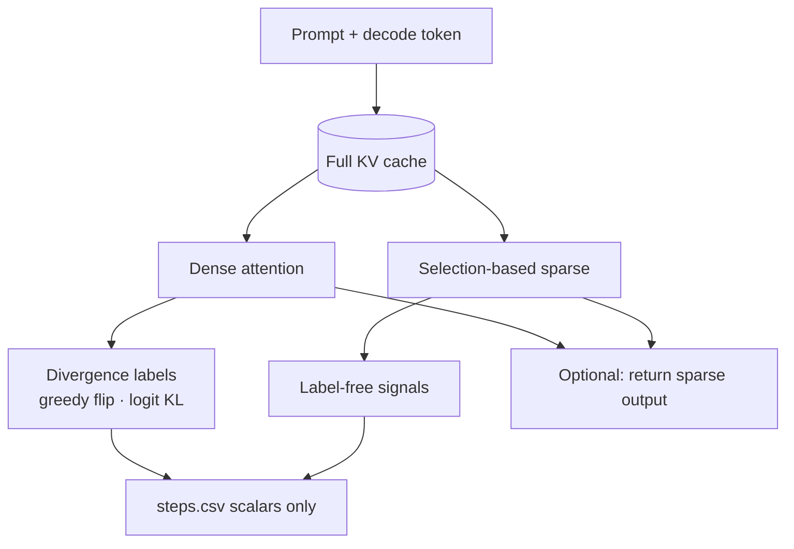

| Mechanism | Idea | Code |
|---|---|---|
| **1. Label-free detection** | Discarded block scores estimate omitted attention mass; cross-head eviction consensus catches globally erased content. | [`csa/sparse.py`](csa/sparse.py), [`csa/signals.py`](csa/signals.py), [`csa/detector.py`](csa/detector.py) |
| **2. Sampled dense verification** | Dense probes on identical KV feed an anytime-valid confidence sequence; adaptive sampling uses Horvitz–Thompson weights. | [`csa/verify.py`](csa/verify.py) |
| **3. Elastic verification work** | Probes consume slack capacity; under load the **bound widens** instead of latency or silent fidelity loss. | [`csa/scheduler.py`](csa/scheduler.py) |

---

## Headline results (smoke scale)

Measured on **NVIDIA T1000 8GB**, models `Qwen2.5-0.5B-Instruct` and `Qwen2.5-1.5B-Instruct`, contexts 1K–2K. See [`REPORT.md`](results/REPORT.md) for full caveats.

| Hypothesis | Question | Verdict |
|---|---|---|
| **H1** | Divergence detectable label-free? | **Supported** — damage-aligned AUC ≈ **0.84**; combined detector CV AUC **0.92** (kill bar &lt; 0.65) |
| **H2** | Useful bound affordable? | **Not falsified (scale-free)**; short traces inconclusive. Betting CS **fails under bursty drift** |
| **H3** | Elastic under load? | **Shape supported (simulation)** — elastic TPOT ≈ baseline; inline latency collapses |
| **H4** | Divergence ↔ task wrongness? | **Supported** — Spearman **−0.870** answerable, **−0.821** within budget (0.5B v2, regenerated; kill bar \|ρ\| &lt; 0.5) |

**Methodological guards baked into analysis** ([`csa/analysis.py`](csa/analysis.py)):

1. Within-budget AUC (pooled AUC is inflated by budget).
2. H4 conditioned on dense-answerable requests.
3. Grouped cross-validation by request (no i.i.d. leakage).
4. Damage vs uncertainty: margin wins flip-AUC but fails damage correlation — dropped-mass / consensus are the fidelity signals.

**Defects found by audit, stated rather than quietly fixed.** Study A runs
before `results/study_a_*_v2/` had three faults that all suppressed or
corrupted accuracy without ever crashing:

1. **Unreproducible task seeds.** Seeds came from
   `hash((seed, fam, i, target_tokens))`; `hash()` on a tuple containing a
   `str` is salted by `PYTHONHASHSEED`, which CPython randomizes per process,
   so those runs drew gold answers from a state that cannot be reconstructed —
   re-running the same commit does not reproduce them.
2. **Substring answer matching.** `key` scored correct inside `monkey`.
3. **Two broken tasks.** Coreference aliases were occupation-shaped ("the
   archivist"), making the profession question ambiguous; reasoning traces hit
   a 64-token cap before stating their total, so the family scored an
   intermediate count.

All are fixed — `blake2b` seeds, word-boundary and last-integer checks,
non-agentive aliases, and a named `LONG_DECODE_MIN_TOKENS` budget — each with
a regression test, including one that runs the generator under two values of
`PYTHONHASHSEED` and asserts identical output.

**H4 has been regenerated and still clears its bar** (ρ = −0.870 answerable,
−0.821 within budget). H1, H2, H3 and all six ablations never call
`Task.check` and were never affected. Worth noting for anyone auditing similar
work: old and new dense accuracy are 0.438 and 0.458, so nothing in the
summary numbers looked wrong. Details in
[`METHODOLOGY.md`](results/METHODOLOGY.md#5-reproducibility).

---

## Result catalog with tags

Each run directory includes `*.meta.json` (machine fingerprint) and online-aggregated CSVs only — never raw attention tensors.

| Directory | Tags | Description | Key result |
|---|---|---|---|
| [`results/study_a_0.5b/`](results/study_a_0.5b/) | `#study-a` `#h1` `#superseded` `#qwen-0.5b` `#t1000` | 0.5B paired sweep — **SUPERSEDED**, retained for provenance | Best LF AUC **0.85** (margin); damage-aligned **0.79**. H4 figures withdrawn |
| [`results/study_a_1.5b/`](results/study_a_1.5b/) | `#study-a` `#h1` `#superseded` `#qwen-1.5b` `#t1000` | 1.5B full Study A — **SUPERSEDED**, retained for provenance | Damage-aligned AUC **0.84**; combined CV **0.92**. H4 figures withdrawn |
| [`results/study_a/`](results/study_a/) | `#superseded` | First Study A run (intermediate code) | Kept for provenance; see `SUPERSEDED.md` |
| [`results/study_b/`](results/study_b/) | `#study-b` `#h2` `#confidence-sequences` | Bound width vs probe cost; coverage audit under i.i.d. / bursty | Scale-free H2 **not falsified**; adaptive+Betting burst miss **0.97** |
| [`results/study_c/`](results/study_c/) | `#study-c` `#h3` `#scheduler` `#simulation` | Elastic vs inline vs none under load | High-load P99 TPOT: elastic **17.5** vs inline **44** (none 19.5) |
| [`results/ablations/`](results/ablations/) | `#ablations` `#transfer` `#detector` | Signals alone/combined; rate 0→100%; fixed vs adaptive; transfer | Cross-model transfer AUC **0.92** (0.5B→1.5B) |
| [`results/ablation6/`](results/ablation6/) | `#ablation-6` `#layer-budget` `#pyramid` | Per-layer schedules at matched mean keep fraction | Detector CV AUC **0.87–0.93** within schedules; cross-schedule transfer ≥ **0.92** |
| [`results/overhead/`](results/overhead/) | `#overhead` `#probe-cost` `#gather-path` | Production sparse vs dense wall-clock on T1000 | Speedup ≈ **1.0–1.12×**; r ≈ **1.0–1.12** (MLP-bound host) |
| [`results/REPORT.md`](results/REPORT.md) | `#verdicts` `#phase-l` | Written verdicts against pre-committed gates | H1/H4 supported; H2 scale-free OK; H3 sim-only |
| [`results/TABLES.md`](results/TABLES.md) | `#tables` | `make_tables.py` output | Paste-ready numbers for papers |

**Hardware tag (all Phase L runs):** `#nvidia-t1000-8gb` · driver 596.51 · CUDA 12.4 · Windows smoke host.

---

## Figures

All plots are generated by the experiment drivers (never hand-drawn). Click through to the run directories for CSVs and fingerprints.

### Study A — detection, cliff, calibration, traces

`#h1` `#roc` `#qwen-1.5b`

**ROC (1.5B, teacher-forced, budgets pooled)** — label = greedy-token flip. Dropped-mass / consensus track the oracle; margin is high-AUC but low damage correlation.

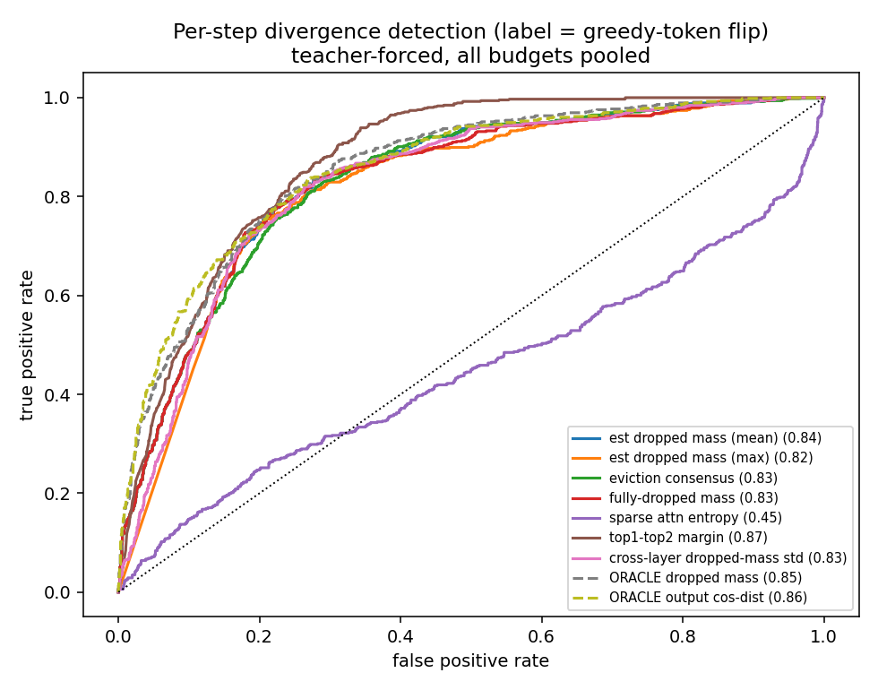

`#cliff` `#accuracy` `#flip-rate`

**Fidelity cliff** — end-task accuracy and per-request flip fraction vs keep budget. Divergence stays well above 0.1% at tight budgets. (The flip panel is gold-independent and stands; the accuracy panel is regenerating.)

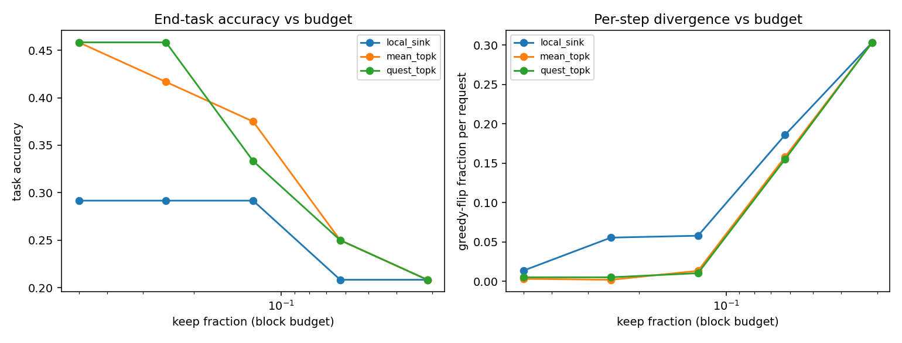

`#calibration` `#dropped-mass`

**Detector calibration** — estimated dropped mass (label-free) vs empirical flip rate.

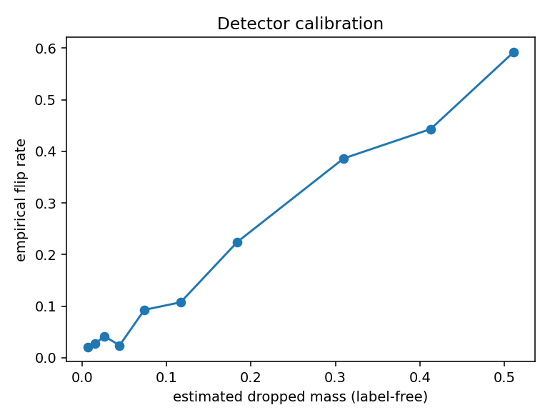

`#trace` `#oracle`

**Divergence trace** — label-free vs oracle dropped mass over decode steps; crimson lines mark greedy-token flips.

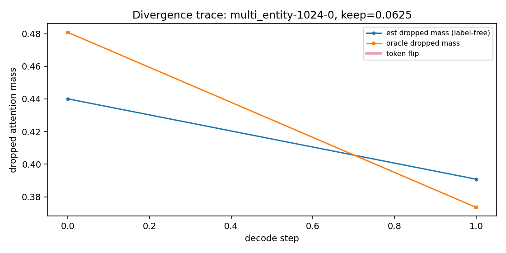

Same suite for 0.5B (`#qwen-0.5b`): [`results/study_a_0.5b/figures/`](results/study_a_0.5b/figures/).

| 0.5B ROC | 0.5B cliff |
|---|---|
| 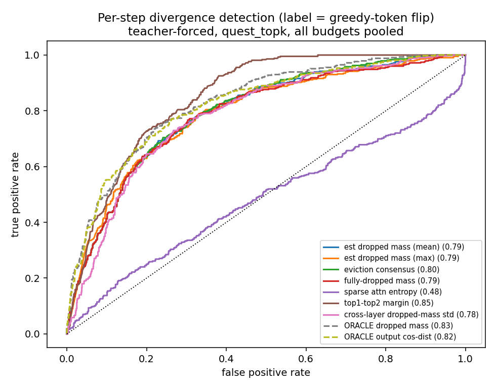 | 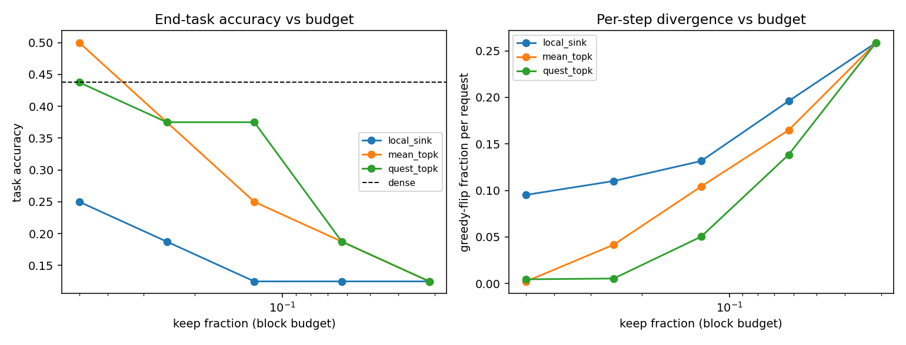 |

### Study B — bound width vs verification cost + coverage

`#h2` `#hoeffding` `#empirical-bernstein` `#betting-cs`

**Width vs cost** — anytime-valid bound width against probe rate / throughput cost. Coverage gates which estimators may support a verdict.

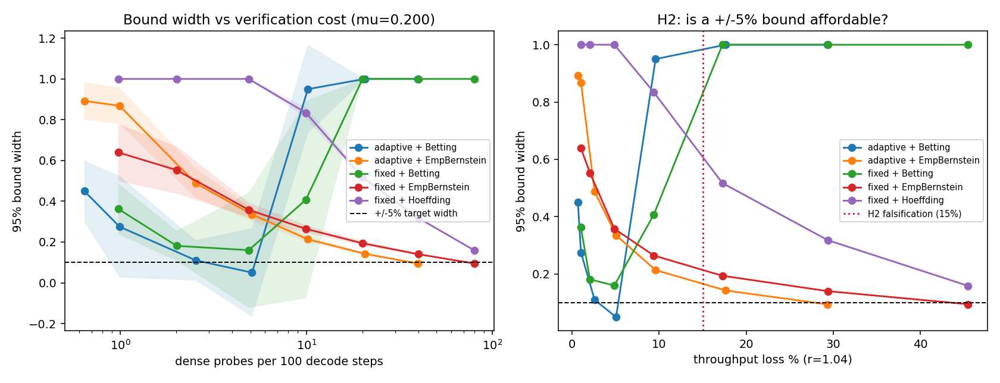

**Coverage audit** — anytime miss rate by regime. Capital-process (betting) estimators fail under bursty drift; Hoeffding / EB remain valid.

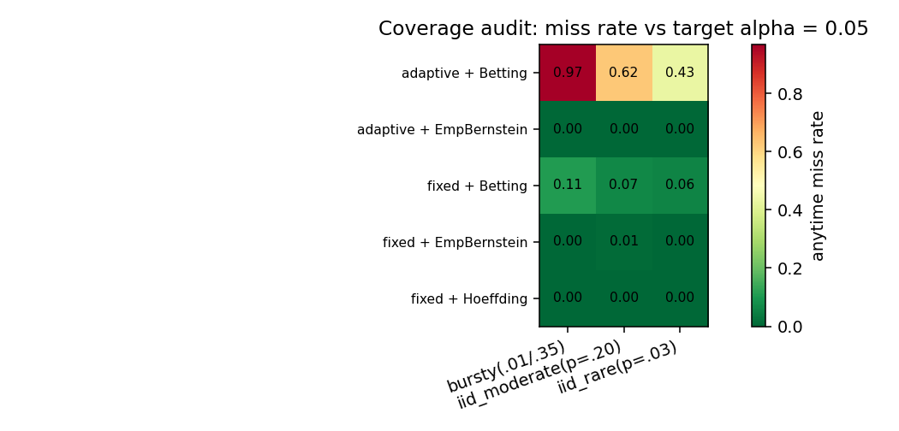

### Study C — elastic scheduling (discrete-event simulation)

`#h3` `#elastic` `#tpot` `#simulation`

**Elastic vs inline vs none** — under load, elastic keeps TPOT near the no-verification baseline while the confidence bound widens; inline pays latency.

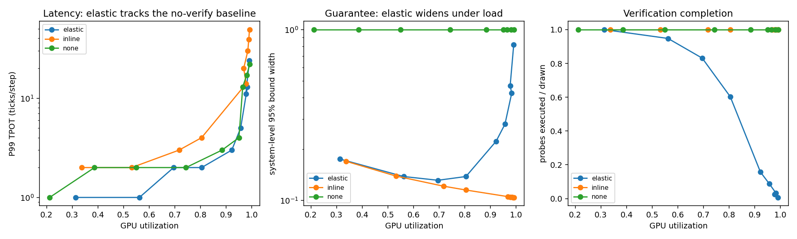

### Ablations

`#ablation-2` `#verification-rate` · `#ablation-3` `#adaptive-sampling`

| Verification rate 0→100% — recovers unverified sparse and full-dense endpoints | Fixed vs adaptive at equal probe cost — value of Mechanism 1 to Mechanism 2 |
|---|---|
| 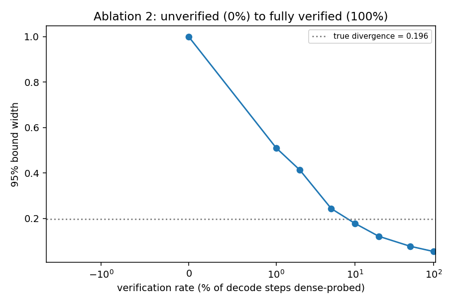 | 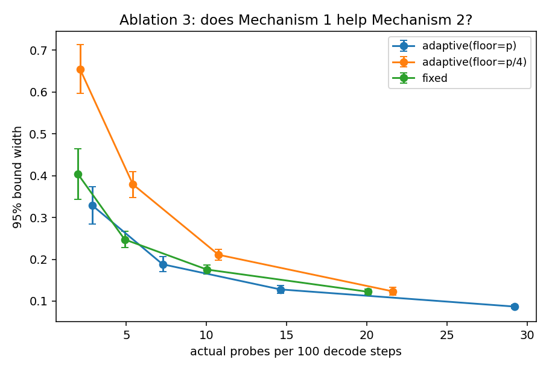 |

`#ablation-5` `#transfer` `#cross-model`

| Detector transfer by task family | Detector transfer by keep budget |
|---|---|
| 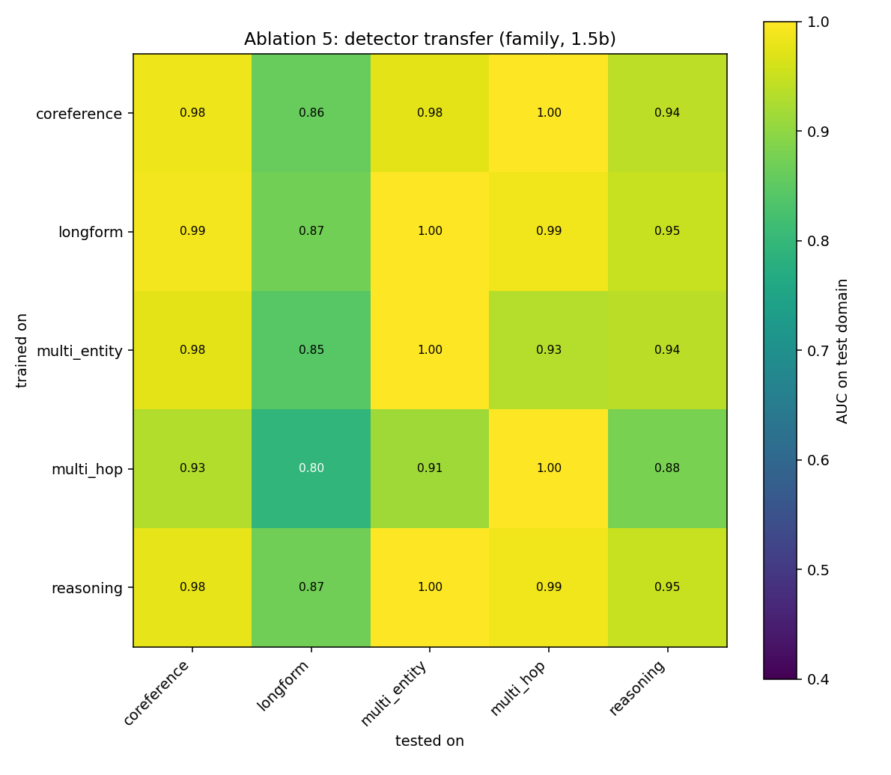 | 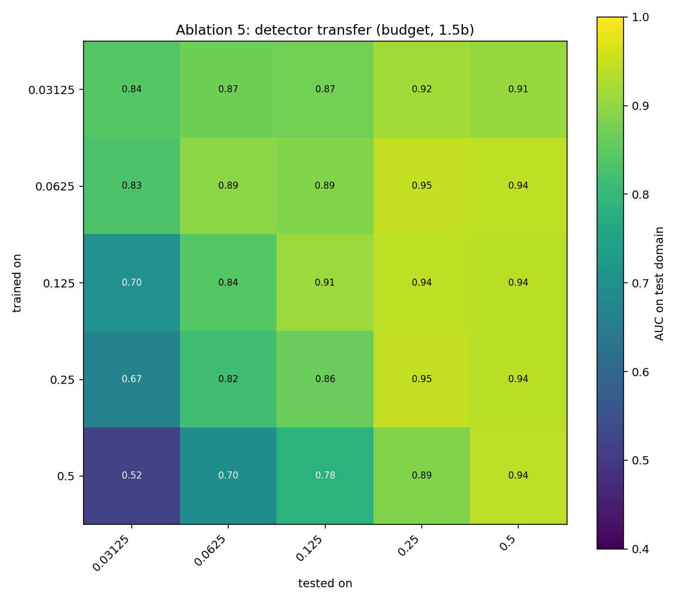 |

`#ablation-6` `#layer-schedule` `#pyramid`

**Per-layer budget schedules** at matched mean keep fraction — fidelity differs by schedule; the label-free detector still transfers across allocators.

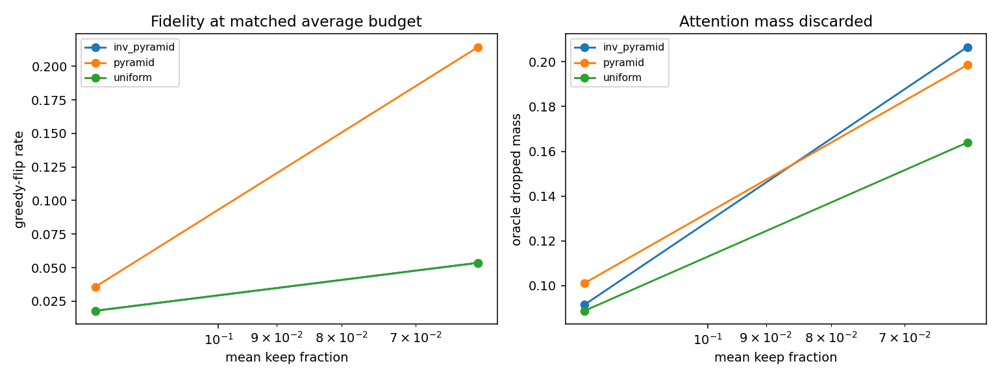

---

## Repository layout

```text
csa/                  # Core library
  sparse.py           # Block selection, gather path, schedules
  signals.py          # Label-free + oracle signals
  detector.py         # Combined logistic detector, grouped CV
  verify.py           # Confidence sequences + HT sampling
  scheduler.py        # Elastic verification simulator
  paired.py           # HF AttentionInterface harness
  analysis.py         # Shared Study A analysis (do not fork)
  tasks.py            # Synthetic long-context tasks
  recording.py        # Machine fingerprint + CSV discipline

experiments/          # Study / ablation drivers
tests/                # 60 unit tests (pytest)
results/              # Fingerprinted runs, figures, REPORT
docs/                 # Serving RFC draft
```

**Recording discipline:** online-aggregated per-step scalars only — never raw attention tensors. Every run ships a machine fingerprint (GPU, driver, power limit, PCIe, library versions).

---

## Quick start

```bash
python -m pip install -e ".[dev]"
python -m pytest tests -q
python experiments/smoke_check.py
```

Requirements: Python ≥ 3.10, PyTorch ≥ 2.2 with CUDA (CPU works for unit tests; sweeps need a GPU). Use `python -m pip` so installs land in the same interpreter that runs the code.

---

## Reproduce studies

| Study | Command | Outputs |
|---|---|---|
| **A** (H1/H4) | `python experiments/study_a_smoke.py --model Qwen/Qwen2.5-1.5B-Instruct --out results/study_a_1.5b` | `steps.csv`, `requests.csv`, figures, `summary.json` |
| **A analysis** | `python experiments/analyze_study_a.py results/study_a_0.5b results/study_a_1.5b` | Rewrites `summary.json` + figures |
| **B** (H2) | `python experiments/study_b_estimators.py` | Width–cost curves, coverage audit |
| **C** (H3) | `python experiments/study_c_scheduler.py` | Elastic vs inline load sweep |
| **Ablations 1–5** | `python experiments/ablations.py` | Signal isolation, rate sweep, transfer |
| **Ablation 6** | `python experiments/ablation6_layer_budget.py` | Layer-schedule composition |
| **Overhead** | `python experiments/overhead_bench.py` | Probe/sparse cost ratio `r` |
| **Tables** | `python experiments/make_tables.py --out results/TABLES.md` | Paste-ready markdown tables |

Sparse methods: `quest_topk`, `mean_topk`, `local_sink`. Layer schedules: `uniform`, `pyramid`, `inv_pyramid` (budget-matched by construction).

Tasks: multi-entity tracking, multi-hop chains, coreference, multi-step reasoning, longform — chosen for known sparse-attention failure modes (not NIAH-only).

---

## Status and roadmap

| Phase | Scope | Status |
|---|---|---|
| **L** — local smoke | 0.5B + 1.5B @ 1–2K on T1000; Studies A/B/C + ablations | **Done** — see [`REPORT.md`](results/REPORT.md) |
| **R1** — Gate 1 | 8B @ 16K–128K on H100; scale transfer | Pending (rented GPU) |
| **R2** — Gate 2 | Production probe-rate overhead on characterized host | Pending |
| **R3** — Gate 3 | Elastic probes inside vLLM | Pending |
| **F** — final | Full matrix, paper, upstream RFC → PR | Pending |

Smoke-scale hardware is **not** the regime where sparse attention pays (KV-bandwidth-bound 8B+ at long context). Threats to validity are enumerated in [`METHODOLOGY.md`](results/METHODOLOGY.md) **before** results were interpreted.

---

## Skills and stack

PyTorch · Hugging Face Transformers · selection-based sparse attention (Quest-style block scoring) · anytime-valid confidence sequences (Hoeffding, empirical-Bernstein, betting martingales) · Horvitz–Thompson inverse-propensity weighting · grouped cross-validation · discrete-event GPU scheduling · experimental methodology for LLM systems research.

---

## Citation

If you use this code or the paired dense/sparse traces, please cite the repository and link the run fingerprint from the relevant `*.meta.json`.

```bibtex
@software{certified_sparse_attention,
  title        = {Certified Sparse Attention: Runtime-Verified Fidelity for Sparse-Attention LLM Serving},
  author       = {Archana Chetan},
  year         = {2026},
  url          = {https://github.com/ArchanaChetan07/sparse-attention},
  note         = {Smoke-scale results on Qwen2.5-0.5B/1.5B; see results/REPORT.md}
}
```

---

## License and contact

See the repository for license terms. Issues and discussion welcome via GitHub. Upstream serving integration design: [`docs/RFC-runtime-fidelity-verification.md`](docs/RFC-runtime-fidelity-verification.md).
